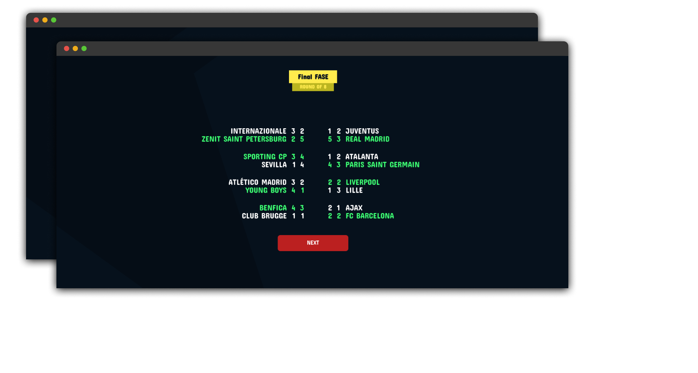

  

# Sport bet

## Description

This is a web browser game with a bet concept. It envolves teams from top divisions of main leagues fighting against each other on the format of the Champions League tournament.

[Click here to play on browser](https://sport-bet.vercel.app/)

## Game pictures

  

## Incoming changes 

- [ ] relate fan_quota of each match accordingly to the importance of the game
- [ ] fan_quota affects game odds
- [x] hall of fame
- [x] hall of shame
- [ ] option to move one group at a time on group fase 
- [ ] create random players to keep the market flowing
- [ ] investment on team system
  - [ ] the more money you bet on a team, the worsen the odds gets for the nexts bets
- [ ] add new team interface
- [ ] mid-season statistics interface
- [ ] add onerror property on images
- [ ] add confirmation for deletion of .json file of the past season

