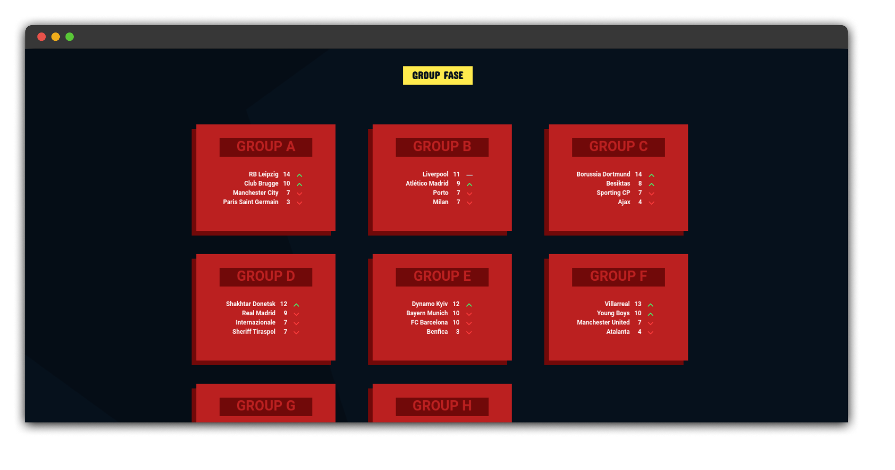

# ⚽ Sport Bet: The Ultimate UCL Simulator

**Experience the thrill of the 2021/2022 Champions League season right from your browser.** Sport Bet is a dynamic web-based simulation game where strategy meets luck. Pit Europe’s elite clubs against one another in a high-stakes tournament format, meticulously modeled after the iconic 21/22 UCL bracket.

[**Run Locally**](#-getting-started) | [**Report Bugs**](https://github.com/matheusschreiber/sport_bet/issues) | [**Request Feature**](https://github.com/matheusschreiber/sport_bet/issues)

---

## 🕹️ Game Overview

Step into the shoes of a high-roller. This isn't just a game of chance; it’s a tribute to one of the most exciting seasons in football history. Navigate through the Group Stages, survive the Knockouts, and see if your predictions can carry you to the Final.

### Key Features
* **Authentic 21/22 Format:** Relive the drama of the specific tournament structure that defined a classic era.
* **Elite Rosters:** Features top-division powerhouses from Europe's most prestigious leagues.
* **Instant Simulation:** High-performance logic ensures match results are calculated seamlessly.
* **Responsive UI:** Designed for a smooth experience whether you're on a desktop or a mobile device.

---

## 📸 Screenshots

| Match Day Overview | Betting Interface | Tournament Bracket |
| :---: | :---: | :---: |
|  |  |  |
| *Analyze the odds* | *Place your stakes* | *Track the progress* |

|  |  |
| :---: | :---: |
|  |  | 
 |  |

---

## 🚀 Getting Started

### Prerequisites
To run this locally, you just need a modern web browser. 

### Installation
1. **Clone the repository:**
   ```bash
   git clone [https://github.com/matheusschreiber/sport-bet.git](https://github.com/matheusschreiber/sport-bet.git)
   ```
   
2. **Navigate to the directory:**
    ```bash
    cd sport-bet
    ```
3. **Run docker:**
    ```bash
    docker compose up -d
    ```

## 🛠️ Built With

- HTML5 - For the structural foundation.

- CSS3 - Custom styling and responsive layouts.

- JavaScript - The engine driving the tournament logic and betting mechanics.

_**Note**: This project is for entertainment purposes and uses simulated currency._